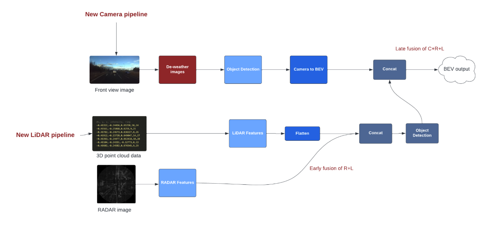
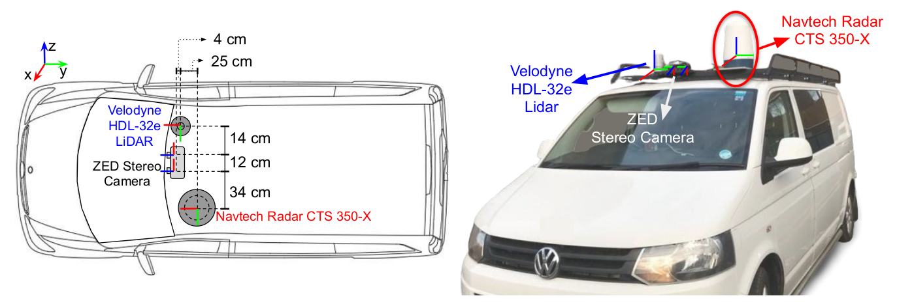
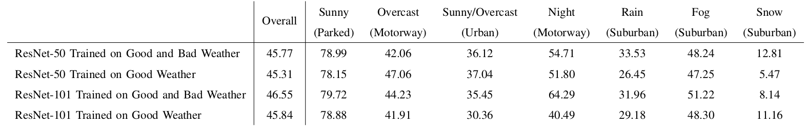
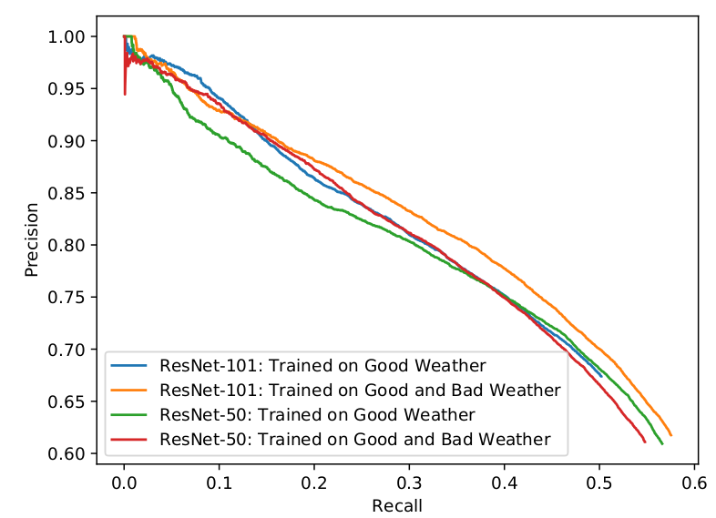
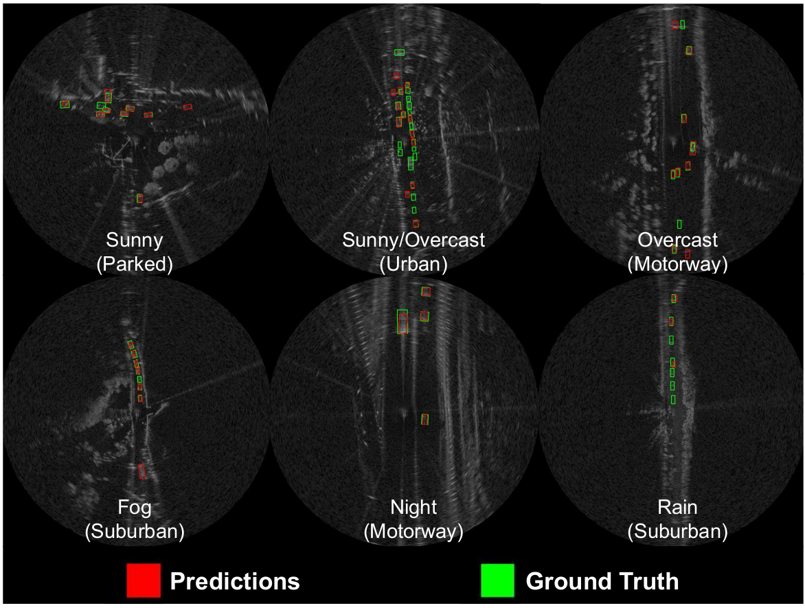

# Bird’s Eye View of Road Attributes in Bad Weather Conditions

BEV map for object detection of road attributes in bad weather and lighting conditions.

Goals:
- Image pre-processing through transformers that works to restore images.
- Early objection detection and transformation of images for BEV.
- Early RADAR-LiDAR fusion for BEV map generation, late camera fusion for object detection.
- Weather conditions: night, rain, snow and fog.

## DATASET: RADIATE
A big thanks to Heriot-Watt University for creating RADIATE (RAdar Dataset In Adverse weaThEr) dataset which includes Radar, Lidar, Stereo Camera and GPS/IMU.

We collected data in different weather scenarios (sunny, overcast, night, fog, rain and snow) to help the research community to develop new methods of vehicle perceptio
Sensors

* **Stereo Camera**: An off-the-shelf ZED stereo camera is used. It is set at 672 × 376 image resolution at 15 frames per second for each camera. It is protected by a waterproof housing
for extreme weather. The images can be seriously blurred, hazy or fully blocked due to rain drops, dense fog or heavy snow, respectively.
* **LiDAR**: A 32 channel, 10Hz, Velodyne HDL-32e LiDAR is used to give 360° coverage. Since the LiDAR signal can be severely attenuated and reflected by intervening fog or snow the data can be missing, noisy and incorrect.
* **Radar** RADIATE adopts the Navtech CTS350-X radar. It is a scanning radar which provides 360° high-resolution range-azimuth images. It has 100 meters maximum operating range with 0.175m range resolution, 1.8° azimuth resolution and 1.8° elevation resolution, Currently, it does not provide Doppler information.
* **GPS/IMU** : Advanced Navigation GPS/IMU is provided. 

## Vehicle Detection

As first baseline, we have performed evaluation of vehicle detection from single images. We defined a vehicle as one of the following classes: car, van, truck, bus, motorbike and bicycle.

We adopted the popular Faster R-CNN [29] architecture to demonstrate the use of RADIATE for radar based object detection. Two modifications were made to the original architecture to better suit radar detection:

* Pre-defined sizes were used for anchor generation because vehicle volumes are typically well-known and radar images provide metric scales, different from camera images.
* We modified the Region Proposal Network (RPN) from Faster R-CNN to output the bounding box and a rotation angle which the bounding boxes are represented by x, y, width, height, angle.
  
To investigate the impact of weather conditions, the models were trained with the 2 different training datasets: data from only good and data from both good and bad weather. ResNet-50 and ResNet-101 were chosen as backbone models. The trained models were tested on a test set
collected from all weather conditions and driving scenarios. The metric used for evaluation was Average Precision with Intersection over Union (IoU) equal to 0.5, which is the same as the PASCAL VOC and DOTA evaluation metric.

Below we can visualise a table with the results for each scenario and the Precision Recall curve for each network trained.

The figure bellow illustrates some qualitative results
of radar based vehicle detection in various driving scenarios and weather conditions, using Faster R-CNN ResNet-101 trained in good weather only.

The code and the trained weights from radar based vehicle detection can be seen at [https://github.com/marcelsheeny/radiate_sdk/tree/master/vehicle_detection](https://github.com/marcelsheeny/radiate_sdk/tree/master/vehicle_detection)
