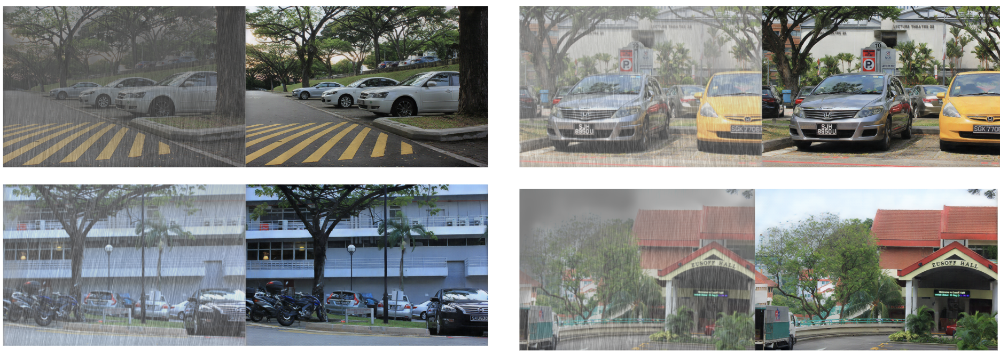
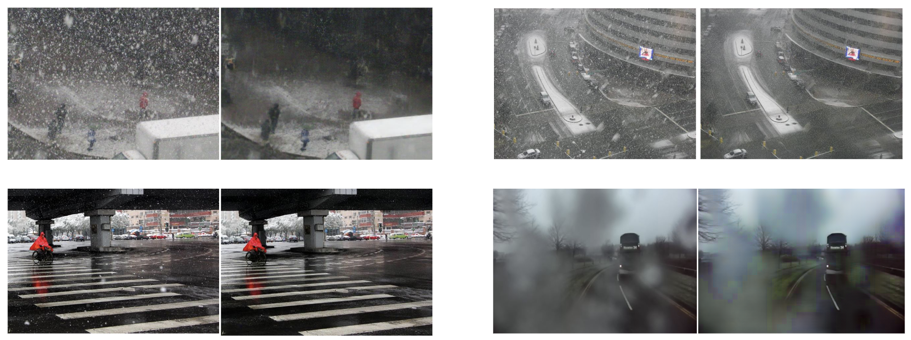
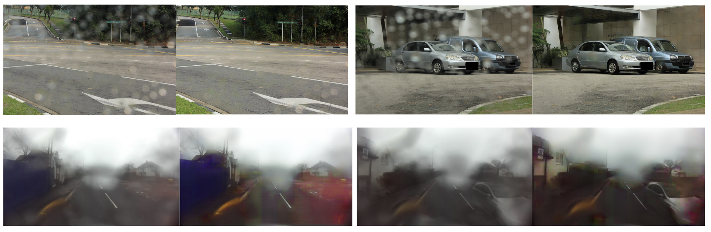
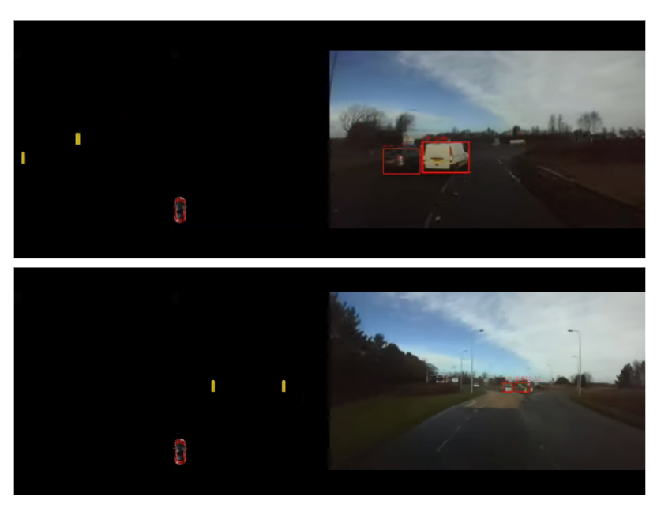

# Bird’s Eye View of Road Attributes in Bad Weather Conditions

BEV map for object detection of road attributes in bad weather and lighting conditions.

Goals:
- Image pre-processing through transformers that works to restore images.
- Early objection detection and transformation of images for BEV.
- Early RADAR-LiDAR fusion for BEV map generation, late camera fusion for object detection.
- Weather conditions: night, rain, snow and fog.

### DATASET: RADIATE
A big thanks to Heriot-Watt University for creating RADIATE (RAdar Dataset In Adverse weaThEr) dataset which includes Radar, Lidar, Stereo Camera and GPS/IMU.

We collected data in different weather scenarios (sunny, overcast, night, fog, rain and snow) to help the research community to develop new methods of vehicle perceptio
Sensors

* **Stereo Camera**: An off-the-shelf ZED stereo camera is used. It is set at 672 × 376 image resolution at 15 frames per second for each camera. It is protected by a waterproof housing
for extreme weather. The images can be seriously blurred, hazy or fully blocked due to rain drops, dense fog or heavy snow, respectively.
* **LiDAR**: A 32 channel, 10Hz, Velodyne HDL-32e LiDAR is used to give 360° coverage. Since the LiDAR signal can be severely attenuated and reflected by intervening fog or snow the data can be missing, noisy and incorrect.
* **Radar** RADIATE adopts the Navtech CTS350-X radar. It is a scanning radar which provides 360° high-resolution range-azimuth images. It has 100 meters maximum operating range with 0.175m range resolution, 1.8° azimuth resolution and 1.8° elevation resolution, Currently, it does not provide Doppler information.
* **GPS/IMU** : Advanced Navigation GPS/IMU is provided. 

### DERAINING/DESNOWING/DEFOGGING
We use the TransWeather[https://github.com/jeya-maria-jose/TransWeather] model for preprocessing input images to the camera pipeline. Here are how the results of this model look like in adverse weather conditions:

### CAM2BEV
Approach 1: Since we were provided with only 1 camera, it becomes difficult for us to create a camera-only BEV,
as was outlined in the BevFusion paper. Hence, we began with investigating mathematical models
that would help us achieve a BEV map of what the ego vehicle perceives in front of it. Beginning
with Detectron2, we identified bounding boxes in the image’s 2D co-ordinate plane. From this, we
estimated 3D bounding boxes, picking the top edge to scale and overlay on the RADAR images.
Below is outlined the flow for a singular image going through the Camera to BEV model.

Approach 2: Object detection was carried out on each frame using the YOLOv5 model. Object tracking was also
implemented to track objects across frames based on their centroids. Centroids were calculated for
detected objects, and unique identifiers were assigned to track their movement.
To provide a holistic view of the spatial distribution of objects, we visualized the detected objects in a
bird’s-eye view perspective. This involved applying perspective transformation to the original frame,
transforming it into a bird’s-eye view.
Simulated objects were overlaid onto the transformed frames to enhance the visual representation
of detected objects. For the sake of simplicity, we used the same yellow box across all the different
kinds of objects detected.

### LIDAR + RADAR FUSION
We use early fusion to combine the lidar and radar data. The radar data is available in cartesian and polar frame as images. The lidar data is available as point cloud. The first step involved converting this point cloud data by flattening into 2D plane and storing them as images. These images are then concatenated with radar cartesian images.

Our current downstream task after fusion is vehicle detection. We use this fused data for the same. We used the radar annotations provided by the RADIATE dataset as our ground truth locations of vehicles in the images. We then split the data in train and test set including diverse bad weather conditions like rain, fog and snow across different domains like junctions, motorways and even rural areas. We finetune a pretrained Faster-RCNN model, which was pretrained on COCO dataset, to our train set. 

We conduct three experiments for vehicle detection using lidar and radar data. Firstly using only radar data, followed by using only lidar data and finally using both lidar and radar data. We wanted to see the impact of each type of sensor towards object detection and then deciding which is the best. 
Radar model performs the best for us. 
Here are some links to watch the model perform in:
- Good Weather : [https://youtu.be/BHOxSMDHqgQ?feature=shared]
- Bad Weather : [https://youtu.be/74tuGAbgg0Q?feature=shared]

### HOW TO RUN

### ACKNOWLEDGEMENT
We would like to thank:
1. Professor Ragunathan Rajkumar for guiding us throughout the course 18744
2. Heriot-Watt University for creating RADIATE
3. Marcel Sheeny[https://github.com/marcelsheeny] for creating the radiate sdk
4. bharath5673[https://github.com/bharath5673] for his cool work on Cam2BEV

<!-- 
## Vehicle Detection

As first baseline, we have performed evaluation of vehicle detection from single images. We defined a vehicle as one of the following classes: car, van, truck, bus, motorbike and bicycle.

We adopted the popular Faster R-CNN [29] architecture to demonstrate the use of RADIATE for radar based object detection. Two modifications were made to the original architecture to better suit radar detection:

* Pre-defined sizes were used for anchor generation because vehicle volumes are typically well-known and radar images provide metric scales, different from camera images.
* We modified the Region Proposal Network (RPN) from Faster R-CNN to output the bounding box and a rotation angle which the bounding boxes are represented by x, y, width, height, angle.
  
To investigate the impact of weather conditions, the models were trained with the 2 different training datasets: data from only good and data from both good and bad weather. ResNet-50 and ResNet-101 were chosen as backbone models. The trained models were tested on a test set
collected from all weather conditions and driving scenarios. The metric used for evaluation was Average Precision with Intersection over Union (IoU) equal to 0.5, which is the same as the PASCAL VOC and DOTA evaluation metric.

Below we can visualise a table with the results for each scenario and the Precision Recall curve for each network trained.

The figure bellow illustrates some qualitative results
of radar based vehicle detection in various driving scenarios and weather conditions, using Faster R-CNN ResNet-101 trained in good weather only.

The code and the trained weights from radar based vehicle detection can be seen at [https://github.com/marcelsheeny/radiate_sdk/tree/master/vehicle_detection](https://github.com/marcelsheeny/radiate_sdk/tree/master/vehicle_detection) -->
